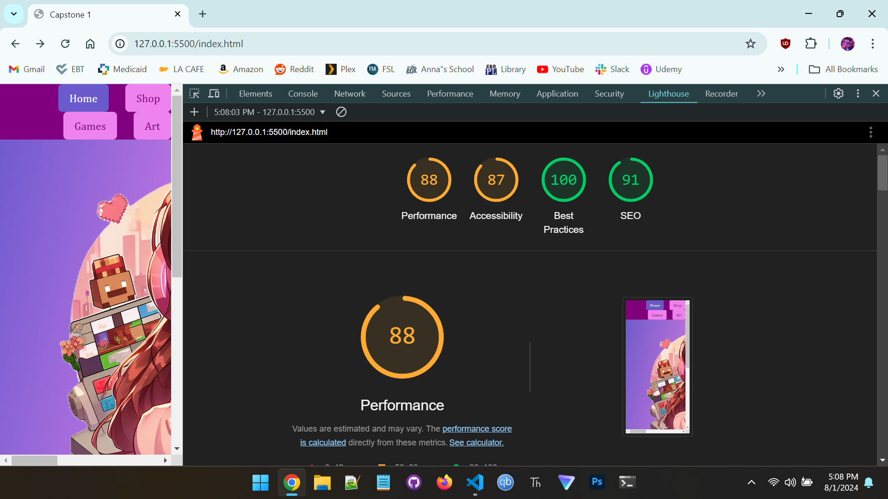

# Lighthouse
## Screenshot

## Screenshot with optimizations

### I managed to improve my score by:
* Resizing the main image on my home page in the photo editor on Windows. For, Performance score.
* There was a heading 3 that came after a heading 1 and I changed it to a heading 2. For Accessability score.
* Added a meta tag with a description of the site. For,  Search Engine Optimization score.
* Changed the colors to better contrast with other colors throughout the website. For, Accessability score.

## Issues
* Serve images in next-gen formats - WebP and AVIF 
* Sufficient contrast ratio - better for users to read.
* Properly size images - help render time.
* Eliminate render-blocking resources - Script tag in the head tag or link tags w/out
defer or async attributes.
* Headers in the right order. Would help with accessability. 

# Performance
## Screenshot

## Optimizations
* Layout shifts with the nav and footer. 
* Image elements explicit width and height - reduce layout shifts.
* Could use CDN for images instead. 
* Browser cache-control.

# Network
## Screenshot

## Optimizations
* Make my images in a faster format to render faster.
* Browser caching. 
* SEO optimization.

# Summary
I think that my overall performance could be improved by using more modern file formats for my images. This could improve load time for the images especially, the main image. I also think that for the desktop the performance gets more layout shifts, from the Bootstrap and CSS but, on mobile the performance is much better. Also, using a websocket connection to improve data exchange from the browser to server. 